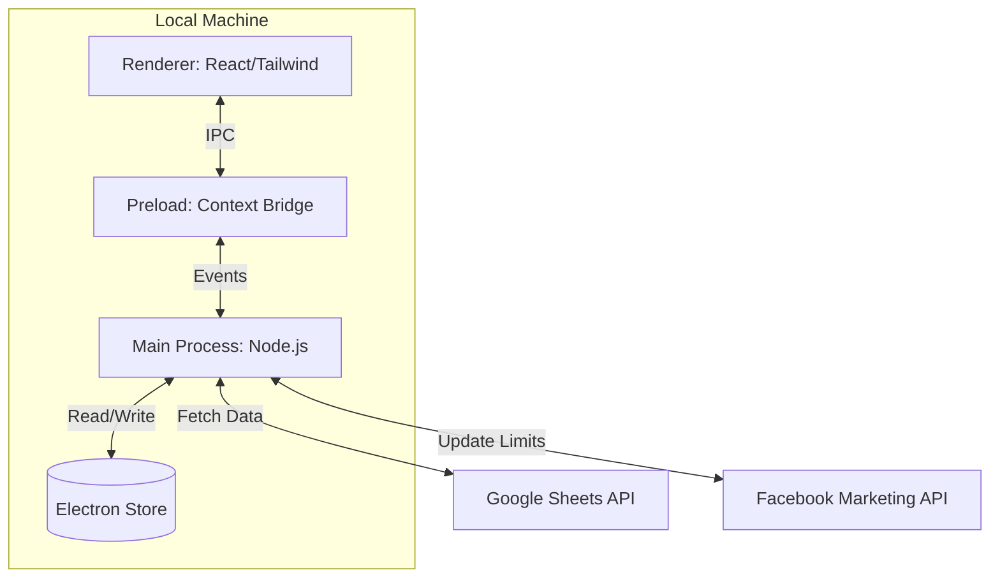

# FB Ads Spending Limit Desktop Controller: Fullstack Architecture

## 1. Introduction
This document outlines the complete architecture for a lightweight Electron-based utility designed to manage Facebook Ad account spending limits via Google Sheets data. It serves as the blueprint for both the Node.js secure backend (Main Process) and the React-based user interface (Renderer).

### Starter Template & Foundation
* **Recommendation:** **Electron-Vite + TypeScript**. 
* [cite_start]**Rationale:** Provides a modern, type-safe environment with built-in Hot Module Replacement (HMR) and secure IPC (Inter-Process Communication) boilerplate, allowing developers to focus on API logic rather than infrastructure[cite: 358].

### Change Log
| Date | Version | Description | Author |
| :--- | :--- | :--- | :--- |
| April 3, 2026 | 1.0 | Finalized Fullstack Architecture | Winston (Architect) |

---

## 2. High Level Architecture

### Technical Summary
The application is a decentralized desktop tool that bridges a Google Sheets data source with the Facebook Marketing API. It uses a **Local-First** model where all credentials and configurations are stored on the user's machine.

### Repository Structure (Monorepo)
* `src/main/`: Secure Node.js environment handling `googleapis` and `axios`.
* `src/renderer/`: React/Tailwind UI for user interaction.
* `src/preload/`: Secure `contextBridge` for IPC communication.

### High Level Diagram

---

## 3. Technology Stack & Data Models

| Category | Technology | Purpose |
| :--- | :--- | :--- |
| **Framework** | Electron | Desktop Shell & Node.js Access |
| **Frontend** | React + Tailwind CSS | Reactive UI & Modern Styling |
| **Backend** | Node.js | API Orchestration & File System Access |
| **APIs** | `googleapis` & `axios` | Sheets Data Fetching & FB Marketing API Calls |
| **Persistence** | `electron-store` | Local Credential & Config Storage |

### Key Data Models
* **`AppConfiguration`**: Stores `googleServiceAccountPath`, `facebookApiToken`, and `excludedTabs`.
* **`AdAccountLimit`**: Represents a single account update containing `accountId`, `dailyLimit`, and current execution `status` (pending/success/error).

---

## 4. Component & IPC Design

### UI Components
1.  **Dashboard**: Multi-select dropdown for Group Selection and "Refresh" action.
2.  **Settings Panel**: Collapsible drawer for sensitive API credentials.
3.  **Execution Log**: Real-time terminal showing live progress of the API loop.

### IPC Channels (Bridge Logic)
* `config:save`: Renderer → Main (Updates local credentials).
* `sheets:fetch`: Renderer → Main (Retrieves tab names and data).
* `execution:log`: Main → Renderer (Streams status updates to the UI).

---

## 5. Error Handling & Resilience

### Rate Limit Mitigation
* **Sequential Loop**: The app processes accounts one-by-one using a `for...of` loop rather than parallel calls to avoid Facebook API rate limits.
* **Configurable Delay**: A 100ms - 500ms delay is injected between calls to maintain "human-like" execution speed.

### Data Validation
* **Date Check**: The parser strictly looks for `dd/MM/yyyy` in Column G. If today's date is missing, the app logs a "Date Not Found" warning and skips the update.
* **Pre-flight Checks**: Before firing the "Set Limit" button, the app verifies the existence of the Service Account JSON and the validity of the FB Token.

---

## 6. Next Steps & Handoff

1.  [cite_start]**Project Scaffolding**: Initialize with `electron-vite-vue` or `electron-vite-react`[cite: 358].
2.  **Service Account Setup**: User must provide a valid GCP JSON path in the Settings Panel.
3.  **Handoff to Developer Agent**: Implement the `GoogleSheetsService` first to ensure data can be read before building the FB update loop.

***

**This concludes the full architecture documentation.** You can now save this as `docs/architecture.md` and provide it to a Developer Agent to begin implementation.